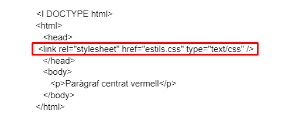
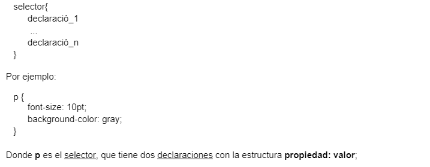
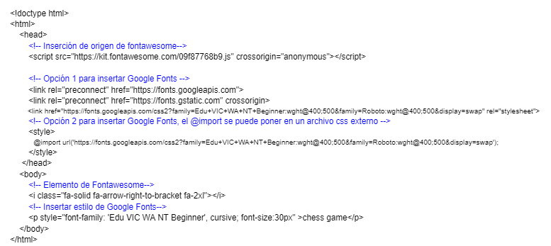

# Apuntes_HTML_CSS
INDICE
-GITHUB
-Markdown
-HTML
-CSS
-Diseño responsive

## GITHUB
¿QUE ES GITHUB?

GitHub es un sitio "social coding". Te permite subir repositorios de código para almacenarlo en el sistema de control de versiones Git.

## Markdown
¿Qué es Markdown y para qué sirve?

Markdown es una forma sencilla de agregar formato a textos en la web y funciona incorporando algunos caracteres a nuestro contenido. Es un código de texto plano, simple y fácil de escribir. Por seguridad y compatibilidad no usamos editor de texto HTML.

Etiquetas básicas de Markdown

Encabezados. Llevan ya asociado un estilo por defecto cada uno.
"#" H1  
"##" H2  
"###" H3  
"####" H4  
"#####" H5  
"######" H6  

## HTML
¿Qué es y para qué sirve el HTML?

El Lenguaje de Marcado de Hipertexto (HTML) es el código que se utiliza para estructurar y desplegar una página web y sus contenidos. Por ejemplo, sus contenidos podrían ser párrafos, una lista con viñetas, o imágenes y tablas de datos.

Estructura documento HTML

Etiquetas básicas HTML

- Encabezados (< h1 > ... < h6 >) 
- Párrafos ( < p > )  
 - Listas:   
  listas desordenadas: < ul >  
  listas ordenadas: < ol >    
 Cada elemento de la lista se coloca dentro de un elemento < li > (list item).  
- Enlaces (< a >)  
- Salto de línea (< br/ >)   
- Línea separadora (< hr/ >)    
- Cita (< blockquote >)  
  
## CSS

¿Qué es y para qué sirve el CSS?
  
Básicamente, es un lenguaje que maneja el diseño y presentación de las páginas web, es decir, cómo lucen cuando un usuario las visita. Funciona junto con el lenguaje HTML que se encarga del contenido básico de las páginas.
  
## UBICACIÓN
  
Documento externo

Se coloca las propiedades de estilo en un documento externo con extensión .css y desde el documento (X)HTML se enlaza con esta hoja de estilo con la etiqueta <link> dentro del elemento <head>. Por ejemplo, el documento (X)HTML tendría el siguiente aspecto:
  

  
## ESTRUCTURA

Una hoja de estilos es un conjunto de reglas que definen la estética final de los documentos (X)HTML que la usan. Cada regla está formada por un selector y un conjunto de declaraciones.

Una declaración está formada por una propiedad y su valor asociado.

Un selector nos sirve para definir a qué elemento o elementos queremos aplicar las declaraciones de la regla. Las declaraciones son las diversas características que han de cumplir los elementos que concuerdan con el selector. A cada propiedad de cada declaración le ponemos el valor que sea necesario.

  
# TIPOS DE SELECTORES

  ## Selector de elementos
 
 Corresponde con todos los elementos de este nombre en la página. El siguiente ejemplo afectaría a TODOS los elementos <a> del documento HTML:
  
  ## Selector de clase
 
 Corresponde con todos los elementos que tengan el atributo class con el valor especificado. Por ejemplo el selector:
  
  ## Selector de id
 
 Corresponde a todos los elementos HTML que tienen un atributo id con el valor especificado.
  
# MAS SELECTORES
  
  ## Selectores universales
 
 Sirven para seleccionar todos los elementos de la página. En el  ejemplo, todos los elementos han de tener un borde solido negro de un pixel:

   * {
         border: 1px solid #000000;
   }

  
  ## Selectores de atributos
 
 Permiten seleccionar elementos en función de los atributos que contienen. En el ejemplo quedan afectados todos los elementos  con un atributo “alt”.
   
   img[alt] {
      border: 1px solid #000000;
   }

Es más útil si se especifica el valor del atributo:

   img[src="alert.gif"] {
      border: 1px solid #000000;
   }

  
  ## Selectores de hijos
 
 Para seleccionar elementos concretos que son hijos DIRECTOS de otros elementos concretos. Por ejemplo, esta regla pone de color azul el texto de los elementos <strong> que son hijos de <h3> pero no el resto de elementos <strong>  

   h3>strong {
      color: blue;
   }

  
## COMPOSICIÓN. Margenes, bordes y relleno en CSS
  
  Margen (margin)
  
  Bordes (border)
  
  Relleno (padding)
  
  
## Google Fonts
 
 En https://fonts.google.com/ localizamos la familia de fuentes que queremos añadir.
 
 
