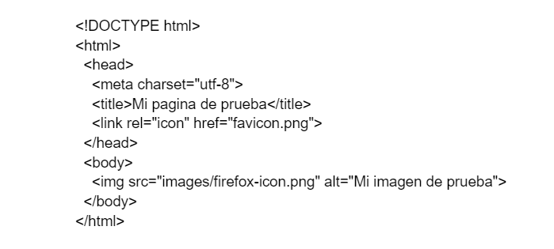

# Apuntes_HTML_CSS
INDICE
-GITHUB
-Markdown
-HTML
-CSS
-Diseño responsive

## GITHUB
¿QUE ES GITHUB?

GitHub es un sitio "social coding". Te permite subir repositorios de código para almacenarlo en el sistema de control de versiones Git.

## Markdown
¿Qué es Markdown y para qué sirve?

Markdown es una forma sencilla de agregar formato a textos en la web y funciona incorporando algunos caracteres a nuestro contenido. Es un código de texto plano, simple y fácil de escribir. Por seguridad y compatibilidad no usamos editor de texto HTML.

Etiquetas básicas de Markdown

Encabezados. Llevan ya asociado un estilo por defecto cada uno.
"#" H1  
"##" H2  
"###" H3  
"####" H4  
"#####" H5  
"######" H6  

## HTML
¿Qué es y para qué sirve el HTML?

El Lenguaje de Marcado de Hipertexto (HTML) es el código que se utiliza para estructurar y desplegar una página web y sus contenidos. Por ejemplo, sus contenidos podrían ser párrafos, una lista con viñetas, o imágenes y tablas de datos.

Estructura documento HTML

Etiquetas básicas HTML

- Encabezados "(<h1>...<h6>)"   
- Párrafos "(
)"  
 - Listas:   
  listas desordenadas: "<ul>"  
  listas ordenadas: "<ol>"    
 Cada elemento de la lista se coloca dentro de un elemento "<li>" (list item).  
- Enlaces "(<a>)"  
- Salto de línea "( )"   
- Línea separadora "(
)"    
- Cita "(<blockquote>)"  
  
## CSS

¿Qué es y para qué sirve el CSS?
  
Básicamente, es un lenguaje que maneja el diseño y presentación de las páginas web, es decir, cómo lucen cuando un usuario las visita. Funciona junto con el lenguaje HTML que se encarga del contenido básico de las páginas.
  
UBICACIÓN
  
Documento externo
  
<link rel="stylesheet" href="estils.css" type="text/css" />
  
ESTRUCTURA
  
TIPOS DE SELECTORES

  Selector de elementos
  
  Selector de clase
  
  Selector de id
  
 MAS SELECTORES
  
  Selectores universales
  
  Selectores de atributos
  
  Selectores de hijos
  
COMPOSICIÓN. Margenes, bordes y relleno en CSS
  
  Margen (margin)
  
  Bordes (border)
  
  Relleno (padding)
  
  
Google Fonts
